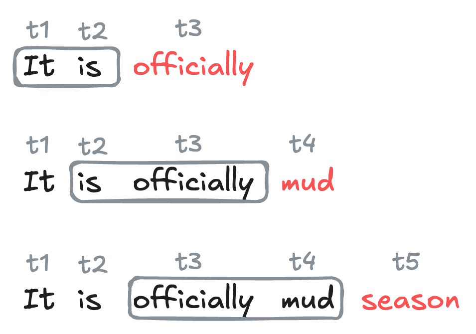



::: {.content-hidden}

## Boilerplate preamble for LaTeX macros and Python viz style
$$

$$

```{python}
import style
```

:::

In this set of notes, we'll begin our discussion of *generative language models*: 

::: {#def-glm}

## Generative Language Model

A *generative language model* is a machine learning model whose primary functionality is to produce sequences of useful text. 

:::

Our aim by the end of these notes is to have a first, functioning generative language model that can produce text in the style of a piece of sample text. We'll continue our experiments with the Dr. Seuss data set that we explored last time. Accordingly, our generative language model will be named: ***Dr. Sus***. 

```{python}
#| code-fold: true
import torch 
import torch
from torchinfo import summary
from torch import nn
device = torch.device("cuda" if torch.cuda.is_available() else "cpu")

import urllib
import pandas as pd
from sklearn.manifold import TSNE
from matplotlib import pyplot as plt

# for appearance
import plotly.express as px
import plotly.io as pio
pio.templates.default = "plotly_white"
pio.renderers.default = "notebook_connected"
```

We'll continue with our experiments on the Dr. Seuss corpus that we studied [last time](50-tokens-embeddings.qmd). 

```{python}
url = "https://raw.githubusercontent.com/PhilChodrow/ml-notes-update/refs/heads/main/data/seuss.txt"
text = "\n".join([line.decode('utf-8').strip() for line in urllib.request.urlopen(url)])
```

### Pretrained Embedding

Before we introduce our main paradigm and model for text generation, we are going to produce a token embedding for our corpus using the same method as in the previous chapter. The code block below reproduces several steps from the previous chapter, including tokenization, dataset construction, and embedding training.

::: {#fig-pretrained-embeddings}

```{python}
#| code-fold: true
# construct tokenizer
from tokenizers import Tokenizer
from transformers import AutoTokenizer, AutoModelForCausalLM

# dataset for embedding
from torch.utils.data import Dataset, DataLoader
class CBOWDataset(Dataset):
    def __init__(self, tokens, context_length):
        self.tokens = tokens
        
        # dict to remap tokens to contiguous integers
        self.token_to_idx = {token: i for i, token in enumerate(set(tokens))}
        self.idx_to_token = {i: token for token, i in self.token_to_idx.items()}
        
        # context length is the number of tokens on either side of the target token
        self.context_length = context_length
        self.data = []
        for i in range(context_length, len(tokens)-context_length):
            for j in range(-context_length, context_length+1):
                if j != 0:
                    self.data.append((self.token_to_idx[tokens[i+j]], self.token_to_idx[tokens[i]]))
                    self.data.append((self.token_to_idx[tokens[i+j]], self.token_to_idx[tokens[i]]))
        
    def __len__(self):
        return len(self.data)
    
    def __getitem__(self, idx):
        return torch.tensor(self.data[idx][0]), torch.tensor(self.data[idx][1])

# CBOW embedding model
class CBOW(nn.Module):
    def __init__(self, vocab_size, d_model):
        super().__init__()
        self.embeddings = nn.Embedding(vocab_size, d_embedding)
        self.linear = nn.Linear(d_embedding, vocab_size)
        
    def forward(self, x):
        embedded = self.embeddings(x) 
        output = self.linear(embedded)
        return output

# for embedding visualization after training
def visualize_embeddings(model, tokenizer, data):

    # extract the embedding weights
    weights = model.embeddings.weight

    # use t-SNE to reduce the dimensionality of the embeddings to 2D
    tsne = TSNE(n_components=2, random_state=42)
    embeddings_2d = tsne.fit_transform(weights.detach().cpu().numpy())

    # make a dataframe for plotly 
    embedding_df = pd.DataFrame(embeddings_2d, columns=["Dim1", "Dim2"])
    embedding_df["Token"] = [tokenizer.decode(data.idx_to_token[i]) for i in range(len(embeddings_2d))]

    # labeled scatter plot of the embeddings
    fig = px.scatter(embedding_df, x="Dim1", y="Dim2", text="Token", title="2D Visualization of Token Embeddings")
    fig.update_traces(textposition='top center')
    fig.update_layout(xaxis_title="Dimension 1", yaxis_title="Dimension 2")
    fig.show()

import warnings
with warnings.catch_warnings():
    warnings.simplefilter("ignore")
    
    checkpoint = "openai-community/gpt2"
    tokenizer = AutoTokenizer.from_pretrained(checkpoint)


    # construct dataset, dataloader, model
    context_length = 5
    tokens = tokenizer.encode(text)
    data = CBOWDataset(tokens, context_length=context_length)
    dataloader = DataLoader(data, batch_size=32, shuffle=True)
    vocab_size = len(data.token_to_idx)
    d_embedding = 8
    model = CBOW(vocab_size, d_model=d_embedding)

    # construct training loss and optimizer

    opt = torch.optim.Adam(model.parameters(), lr=1e-2)
    loss_fn = nn.CrossEntropyLoss()
    model.to(device)

    # training loop
    for epoch in range(5):
        for X_batch, y_batch in dataloader:
            X_batch, y_batch = X_batch.to(device), y_batch.to(device)
            opt.zero_grad()
            output = model(X_batch)
            loss = loss_fn(output, y_batch)
            loss.backward()
            opt.step()

    # take a look at the embeddings
    visualize_embeddings(model, tokenizer, data)
```

:::

Importantly, we're now able to extract the embedding layer from our CBOW model. We can then use the *same* embedding layer in a future model, without the need to train it again. Since we don't need to train the embedding further, we can turn off tracking of gradient information for this layer. 

```{python}
#---
embedding = model.embeddings
embedding.requires_grad_(False)
embedding(torch.tensor([4])) # ex: embedding lookup for a single token
#---
```

## Next-Token Prediction


The current dominant paradigm in generative language modeling is called *next-token prediction*. The idea is to train a model to predict the next token in a sequence of tokens, given the previous tokens:

::: {#def-next-token-prediction}

## Next-Token Prediction

In *next-token prediction*, we treat a sequence of tokens $t_1,t_2,\ldots,t_k$ as a set of *features*, and attempt to use them to predict the identity of the next token $t_{k+1}$ in the sequence.

:::

::: {.callout-note}

## Next-Token Prediction is a Classification Problem

Since the possible values of a given token come from the discrete set of token ids in the vocabulary, we can view next-token prediction as a *classification problem*: given a sequence of tokens, we want to classify the identity of the next token. 

:::

#### Context Length and N-Gram Models

There are many different kinds of models which aim to solve the next-token prediction problem. For this chapter, we'll focus on a simple class of models called *n-gram* models, which use a fixed number of previous tokens as features to predict the next token.

::: {#def-context-length}

## Context Length, N-Gram Models

The *context length* is the number of previous tokens that we use as features to predict the next token in a next-token prediction problem. 

A model that uses a fixed context length of $n$ is often called an *(n+1)-gram* model. 

:::

For example, a model with context length 1 is often called a *bigram* model, since it encodes relationships between pairs of tokens (one feature, one target). A model with context length 2 is often called a *trigram* model, since it encodes relationships between triples of tokens (two features, one target). 


### Datasets for Next-Token Prediction

We're now ready to implement a data set for next-token prediction using an $n$-gram model. To do this, we need to organize our sequence of token ids into a data set of training examples, in which each example consists of a sequence of tokens as features and the next token as the target. We can implement this using a custom `Dataset` class in PyTorch. In the `__init__` method we save several instance variables and tokenize the input text, while in the `__len__` and `__getitem__` methods we implement the logic for how to index into the data set to get the features and target for each example.

[For convenience purposes only, we've arranged for the dataset to return both the token ids and the corresponding text for each example. In practice, only the token ids are needed for training -- the text is just for debugging and our own entertainment.]{.aside} 

```{python}
class SeussDataSet(Dataset):
    def __init__(self, tokens, context_length = 5): 
        self.context_length = context_length
        self.tokens = tokens
        self.vocab_length = len(set(tokens))
        self.idx_to_token = {i: token for i, token in enumerate(set(tokens))}
        self.token_to_idx = {token: i for i, token in enumerate(set(tokens))}


    def __len__(self):
        return len(self.tokens) - self.context_length#<1>
    
    def __getitem__(self, key):
        
        target_token = self.tokens[self.context_length + key]#<2>
        target = torch.tensor(self.token_to_idx[target_token])
        
        feature_tokens = self.tokens[key:(self.context_length + key)]#<3>
        features = [self.token_to_idx[token] for token in feature_tokens]
    
        feature_tensor = torch.tensor(features, dtype=torch.long)

        return feature_tensor.to(device), target.to(device)

```

1. The number of training examples is equal to the total number of tokens minus the context length, since we need at least `context_length` tokens to form the features for the first example.
2. The target token is the token that follows the context in the sequence.
3. The features are the tokens that form the context.

For convenience later, we're also going to implement a simple class that decodes the tokens. The entire puprose of this class is to wrap up the `tokenizer` and the `token_to_idx` map used by our dataset and model; we'll use this when we get to text generation. 

```{python}
class SeussDecoder: 
    def __init__(self, dataset, tokenizer):
        self.dataset = dataset
        self.idx_to_token = dataset.idx_to_token
        self.token_to_idx = dataset.token_to_idx
        self.tokenizer = tokenizer
    
    def decode(self, token_indices):
        tokens = [self.idx_to_token[idx] for idx in token_indices]
        return self.tokenizer.decode(tokens)
```

Let's instantiate each class: 

```{python}
context_length = 10

data = SeussDataSet(tokens, context_length = context_length)
decoder = SeussDecoder(data, tokenizer)

print(f"Number of training examples: {len(data)}")
print(f"Vocabulary size: {data.vocab_length}")
```

Now that we've constructed the data set, we can query it just by indexing: 

```{python}
for i in range(5): 
    X, y = data[i]
    X_text = decoder.decode(X.tolist())
    y_text = decoder.decode([y.item()])
    print(f"Example {i:<2}: {X.tolist()} -> {y}")
    print(" " * 10 + ":", end = "")
    print(repr(X_text), end = "")
    print("-->", end = "")
    print(repr(y_text))
```

Let's add a data loader so that we can train the model with stochastic optimization: 

```{python}
loader = DataLoader(data, batch_size = 256, shuffle = True)
```

A single batch of data from the loader consists of a tensor of features (token ids) and a tensor of targets (token ids), along with the corresponding text for each example in the batch:

```{python}
X_batch, y_batch = next(iter(loader))
print(f"Batch of features (token ids): {X_batch.shape}")
print(f"Batch of targets (token ids): {y_batch.shape}")
```

## Next-Token Prediction with Neural N-Gram Models 

We're now ready to train a simple neural network to perform $n$-gram next-token prediction with one-hot encoded features. For our first approach, we are going to use a simple $n$-gram model, composed only of the pretrained embedding layer, a flattening operation, and some linear processing layers. 

Note that our embedding layer in this model is *not* a new embedding layer (`nn.Embedding`, but rather the pretrained embedding that we trained with CBOW). 

```{python}
#---
embedding.requires_grad_(False)
class SeussModel(nn.Module):
    def __init__(self, vocab_size, context_length, embedding_dim, hidden_dim):
        super().__init__()
        self.embeddings = embedding # use the pretrained embedding from before
        self.hidden = nn.Linear(embedding_dim * context_length, hidden_dim)
        self.output = nn.Linear(hidden_dim, vocab_size)
        
    def forward(self, x):
        embedded = self.embeddings(x) 
        embedded = embedded.view(embedded.size(0), -1) # flatten the context embeddings
        hidden_output = torch.relu(self.hidden(embedded))
        output = self.output(hidden_output)
        return output
#---
```

We're now ready to instantiate Dr. Sus! 

```{python}
#---
model = SeussModel(
    vocab_size = data.vocab_length,
    context_length = context_length, 
    embedding_dim = embedding.weight.shape[1],
    hidden_dim = 16,
    ).to(device)
#---
```

When passed a sequence of tokens, this model produces an unnormalized probability distribution over possible next tokens: 

```{python}
x, y = data[100]
x = x.unsqueeze(0).to(device) # add batch dimension and move to device
output = model(x) # add batch dimension
print(f"Model output shape: {output.shape}")
```

Let's also take a look at the structure: 

```{python}
summary(model, input_size=(x.shape), device=device, dtypes=[torch.long])
```

Time to train: 

```{python}
loss_fn = torch.nn.CrossEntropyLoss()
opt = torch.optim.Adam(model.parameters(), lr=0.005)

loss_history = []
for epoch in range(1000):
    total_loss = 0
    for X_batch, y_batch in loader:
        opt.zero_grad()
        outputs = model(X_batch)
        loss = loss_fn(outputs, y_batch)
        loss.backward()
        opt.step()
        total_loss += loss.item()
    loss_history.append(total_loss / len(loader))
    if epoch % 100 == 0:
        print(f"Epoch {epoch}, Loss: {loss_history[-1]:.4f}")
```

::: {#fig-loss-curve}

```{python}
#| code-fold: true
fig, ax = plt.subplots(figsize = (6, 4))
ax.plot(loss_history, color = "steelblue")
ax.set_xlabel("Epoch")
ax.set_ylabel("Cross-entropy loss (training set)")
ax.set_title("Training Loss Over Time")
ax.semilogx()
plt.show()
```

Training loss over epochs for the next-token prediction model. 

:::

Having trained the model, we can use the `forward` method to get the model's predicted scores for the next token:  

```{python}
x, y = data[240]
x = x.unsqueeze(0).to(device) # add batch dimension and move to device
output = model(x) # add batch dimension
```

A simple method for text generation is just to predict the token that receives the highest score from the model. 

```{python}
t = torch.argmax(output, dim=1).item()

print(repr(decoder.decode(x.tolist()[0])), end = "")
print("-->", end = "")
print(repr(decoder.decode([t])))
```

Deterministic prediction always eventually produces text that repeats itself, so modern approaches typically inject some amount of tunable randomness into the generation process. 

### Stochastic Generation via Boltzmann Sampling

In *stochastic prediction*, we treat the scores as defining a probability distribution over the possible next tokens, and we sample from this distribution to get our prediction. The most common choice of probability distribution is the *Boltzmann* distribution.

::: {#def-boltzmann-prediction}

## Boltzman Distribution, Temperature

Given a vector $\vs \in \R^k$ of scores for each of $k$ possible next tokens, the *Boltzmann distribution* is a probability distribution over the $k$ tokens defined by the scores $\vs$ and a parameter $T > 0$ called the *temperature*. It has formula 

$$
\begin{aligned}
    p(t) = \frac{e^{\beta s_t }}{\sum_{t'} e^{\beta s_{t'} }}\;, 
\end{aligned}
$$

where $\beta = 1/T$. 

:::

Larger values of $T$ lead to more random predictions, while smaller values of $T$ lead to more deterministic predictions. [Random predictions are sometimes called "creative" among certain enthusiasts.]{.aside} In the limit as $T \to 0$, the Boltzmann distribution converges to a distribution that puts all of its mass on the token with the highest score, which is exactly what deterministic prediction does. In the limit as $T \to \infty$, the Boltzmann distribution converges to the uniform distribution over all tokens, which corresponds to completely random prediction.

```{python}
#---
def boltzmann_prediction(preds, temperature = 1.0):
    probabilities = torch.nn.Softmax(dim = 0)(preds / temperature)
    return torch.multinomial(probabilities, num_samples=1).item()
#---
```

Since the $T \to 0$ limit of the Boltzmann distribution corresponds to deterministic prediction, we can implement deterministic prediction using the `boltzmann_prediction` function by setting the temperature to a very small value.

Let's try out the Boltzmann prediction function with different values of the temperature parameter: 

```{python}
X, y = data[2000]
preds = model.forward(X.unsqueeze(0)).squeeze(0)

print(f"Feature text: '{repr(decoder.decode(X.tolist()))}'")

for temp in [0.001, 0.5, 2.0]: 
    print(f"\nPredictions with temperature {temp}:")
    print("-----------------------------")
    for _ in range(3):
        y_pred = boltzmann_prediction(preds, temperature = temp)
        print(f"Temperature: {temp}, Predicted token: {y_pred}, {decoder.decode([y_pred])}")
```

For very low temperatures, the predictions are essentially deterministic (we always generate the same prediction), while for higher temperatures, the predictions become more and more random. 

## Recurrent Text Generation

To generate text with our trained model, we start with an initial sequence of tokens, and then repeatedly apply the model to predict the next token, appending each predicted token to the sequence and using the updated sequence as the new input for the next prediction.

::: {#fig-token-prediction}



Illustration of recurrent text generation using word-level tokens and a context length of 2. Each newly-generated token is added to the sequence. The oldest token in the context is dropped, so that the context length remains fixed at 2.

:::

The following function implements this logic for generating text with a trained $n$-gram model. 

```{python}
def generate_text(model, decoder, start_tokens, max_length=20, temperature=1.0):
    generated_tokens = start_tokens.copy()
    
    for _ in range(max_length):
        input_tensor = torch.tensor(generated_tokens[-context_length:], dtype=torch.long).unsqueeze(0).to(device) #<1>
        with torch.no_grad():
            preds = model(input_tensor).squeeze(0) #<2>
        
        next_token = boltzmann_prediction(preds, temperature) #<3>
        generated_tokens.append(next_token) #<4>
    
    return decoder.decode(generated_tokens)
```

1. Take the most recent `context_length` tokens from the generated sequence to form the input for the model.
2. Pass the input through the model to get the predicted scores for the next token.
3. Use the `boltzmann_prediction` function to sample the next token from the predicted scores.
4. Append the predicted token to the generated sequence.

Let's use our function to generate text at a few different temperatures. As we might expect, when the temperature is high, the text is essentially random. 

```{python}
start = "Fox socks. box Knox. Knox in box."
tokens = tokenizer.encode(start)
start_tokens = [decoder.token_to_idx[token] for token in tokens]
```


```{python}
dr_sus = generate_text(model, decoder, start_tokens, max_length=50, temperature=2.0)
print(dr_sus)
```

On the other hand, when the temperature is very low, the text quickly locks into a repetitive pattern. 

```{python}
dr_sus = generate_text(model, decoder, start_tokens, max_length=50, temperature=0.1)
print(dr_sus)
```

At intermediate values, we recover something that is still very chaotic but which also contains occasional flashes of coherent task: 

```{python}
dr_sus = generate_text(model, decoder, start_tokens, max_length=50, temperature=1.0)
print(dr_sus)
```

Further experiments with the model training and temperature parameter may yield more or less coherent text. 


## What's Next? 

You may observe that none Dr. Sus's writings are particularly impressive in terms of their coherence or resemblance to the source material. This reflects: 

A very **small training data set**: just the text of four short children's books. 

A **simple model architecture**, with low embedding dimension and no hidden layers. 

Perhaps most importantly, a **nonspecialized model architecture** that does not account for any of the distinctive structural features of language. An especially important feature we're ignoring here is that language is *sequential* and *recombinant* -- not only does the order of tokens matter, but the same token can have different meanings in different contexts. There are a variety of model architectures designed to account for the distinctive structural features of sequence data like language, especially *recurrent neural networks* and *transformers*. We'll discuss models specialized for sequence modeling in the next chapter. 

